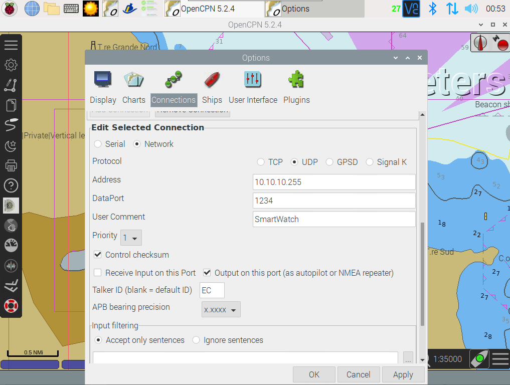
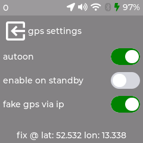

# Main screen


On startup you see the main screen (time tile). It show the time and widgets.

Widgets are:

* the current weather (if correctly configured).
* the notifications.

# Screen Navigation

 You can swipe with you fingers up, down, left and right between the four main screens. The four screens are organized in time, apps, note and setup tile.

# Quick Settings


A subset of settings can be accessed via a swipe from the top of the screen.

# Settings


Once a setting is selected, you can leave the form with the exit button.

## Battery


## Display

Set color, background, touch feedback with vibrations...

## Move

Enable:

* step counter
* double click
* tilt
* display of step counter

The stepcounter value is published to [gadgetbridge](https://gadgetbridge.org) automatically if bluetooth is enabled.
The frequency of publication is driven by gadgetbridge.
Initially, it is on a 30 minutes frequency.
When the realtime tab of gadgetbridge is selected, the frequency is set to every 5 seconds.
If the watch lost contact with gadgetbridge for more than 30 minutes, the stepcounter is also refreshed when bluetooth is reconnected.

## Bluetooth

The bluetooth notification work with [gadgetbridge](https://gadgetbridge.org) very well. But keep in mind, bluetooth in standby reduces the battery runtime.

## WiFi


## Time

* Enable synchronisation when connect
* Display 12/24 hours
* Select region and location

## Utilities

* Format
* Reboot
* Poweroff

## Sound 

* Enable sound
* Set volume

# Applications


## weather app


For the weather app you need an openweather.com api-id. http://openweathermap.org/appid is a good starting point.

## Stopwatch

Click play to start.

## Alarm

You can set an alarm, by setting time and day(s) of the week.

The main switch controls if alarm is enabled or not.

Next, select the day(s) of the week for the alarm.
Note that if no days are select, it means an every day alarm.
Finally, select the hour and minute for the alarm.

In the settings, you can select the reminder: vibe, fade, beep.
You can also have the next alarm displayed on the main face.

## ir-remote

For customise your ir-codes, use [WConfigurator](https://github.com/anakod/WConfigurator).

## OSMAnd


In connection with [OsmAnd](https://osmand.net) the watch can also be used for navigation. Please use the osmand app, otherwise a lot of messages will be displayed.

## Activity tracker


The activity tracker let you check your activity.

In the settings, set your step length and your goals in step and meters.

When associated to Gadgetbrige, activity is reported regularly.
If you need to ensure a synchronization, for example at the beginning of an activity or at the end, you can use the refresh button.
It will force a synchronization.

The trash can button allows to reset step counter.
Useful when starting a new activity an keeping exact track of it.

## Sailing

This app connects to your [OpenPlotter](https://openmarine.net/openplotter) and shows some of your boat stats.

In order to make it work you have to configure your OpenCPN plotter in the connections tab as follows:



Set "Output filtering" to trasmit the sentences: RMB,RMC,APB

Contact [fliuzzi02](https://github.com/fliuzzi02) for further info and help.
Some improvements might come in the future.

# Updates



# FAQ

## how to make a screenshot?


Press the button for 2 seconds, after that an quickmenu appears. Here you can select the tiny camera icon to take a screenshot.
This can be downloaded via the built-in FTP server (binary and passive mode, username: TTWatch and password: passord), if activated.
The file name is screen.data.

Or the other way:

The firmware has an integrated webserver. Over this a screenshot can be triggered. The image has the format RGB565 and can be read with gimp. From bash it look like this
```bash
wget x.x.x.x/shot ; wget x.x.x.x/screen.data
```

Pro-tipp:

[lgrossard](https://github.com/lgrossard)! made a little Python script to generate and download the screenshots from the t-watch [here](https://ludovic.grossard.fr/media/twatch_screenshot.py).

## how to change background?

You can change background in the display settings.

If you want to use your own background image, simply upload a PNG with a resolution of 240x240 pixels via ftp to the Watch and name it bg.png and set it in the display settings page 2.
